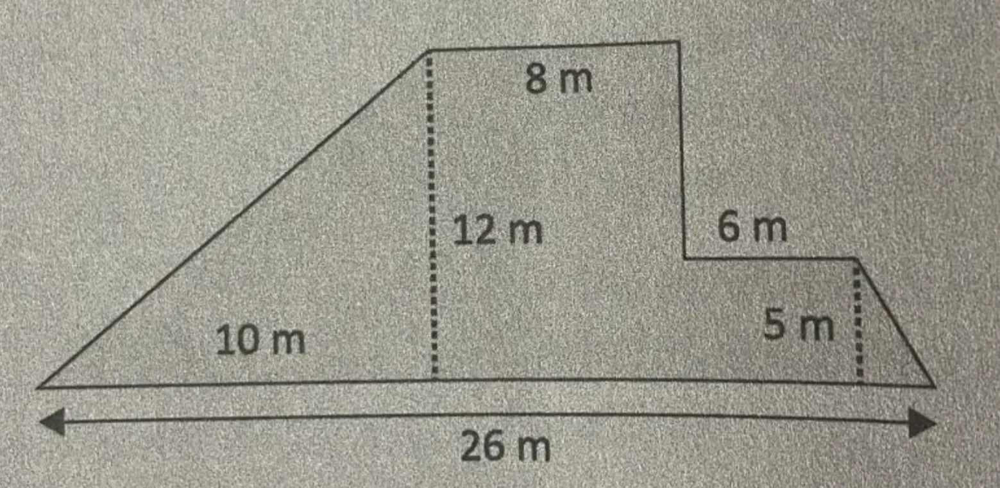

# Taller Procesos - Hilos

1. Plantee un algoritmo que calcule el área de la siguiente figura geométrica descomponiendo en
hilos para optimizar su ejecución.
    
    
    
    
2. Cree un hilo el que le pasaremos los números enteros, n1, n2, y escriba la secuencia compartida
entre ambos números si n1<n2. Desde el hilo principal, muestre un mensaje con el resultado de
la resta.
3. Modifique el código Eventos.py para permitir que, cuando la función genera_eventos() y haya
completado todas sus iteraciones, se termine de forma genérica el programa. Intente a través del
envío de señales mediante la clase Event.
    
    ```python
    #Eventos.py
    import threading
    import time
    '''
    Se debe pensar en estas señales como elementos booleanos que pueden estar activos 
    o innactivos, al tiempo que tenemos bloqueos o cerrduras que solo pueden pasar
    si la señal está activa. 
    '''
        
    def genera_eventos():
      for x in range (5):
        time.sleep(2)
        ev.set()         
      
    def escribe_algo():     
      while (True):
        ev.wait()
        print ("hola")
        ev.clear()     
        
    ev =  threading.Event()
    T1 = threading.Thread(target=genera_eventos)
    T2 = threading.Thread(target=escribe_algo)
    
    T1.start()
    T2.start()
    ```
    
4. Si fuese necesario dotar el archivo Productor-consumidor.py de algún sistema de sincronismo o
protección de la región crítica ¿En qué lugar tendría cabida?
    
    ```python
    #Productor-consumidor.py
    import threading
    import time
    import logging
    import random
    import queue
    
    logging.basicConfig(level=logging.DEBUG,
                        format='(%(threadName)-9s) %(message)s',)
    
    BUF_SIZE = 10
    q = queue.Queue(BUF_SIZE)
    
    class HiloProductor(threading.Thread):
      def __init__(self,name=None):
        super(HiloProductor,self).__init__()
        self.name = name
    
      def run(self):
        while True:
          if not q.full():
            item = random.randint(1,10)
            q.put(item)
            logging.debug('Insertando "' + str(item)  
                          + '" : ' + str(q.qsize()) + ' elementos en la cola')
            time.sleep(random.random())
        return
    
    class HiloConsumidor(threading.Thread):
      def __init__(self,name=None):
        super(HiloConsumidor,self).__init__()
        self.name = name
        return
    
      def run(self):
        while True:
          if not q.empty():
            item = q.get()
            logging.debug('Sacando "' + str(item) 
                          + '" : ' + str(q.qsize()) + ' elementos en la cola')
            time.sleep(random.random())
        return
    
    p = HiloProductor(name='productor')
    p2 = HiloProductor(name='productor2')
    
    c = HiloConsumidor(name='consumidor')
    
    p.start()
    p2.start()  
    c.start()
    ```
    
    La región crítica en el código es la manipulación de la cola `q`, específicamente en las operaciones `put()` y `get()`, donde múltiples hilos pueden acceder concurrentemente y generar condiciones de carrera.
    
    Para solucionar esto, no se deben usar verificaciones previas (`if not q.full()` y `if not q.empty()`), ya que `queue.Queue` maneja la sincronización internamente. En su lugar, simplemente se deben usar `put()` y `get()`, que bloquean automáticamente cuando la cola está llena o vacía, evitando inconsistencias sin necesidad de `Locks` adicionales.
    
5. Cree un hilo que genere números aleatorios entre 1 y 100 y los inserte en una lista, y otro que
recorra circularmente esa lista y sustituya los números que terminan en 0 por el valor -1. Un tercer hilo abortará los otros dos en el momento en que la suma de los elementos de la lista supere el valor de 20000.
6. Cree un programa que ejecute 10 hilos, cada uno de los cuales sumará 100 números aleatorios
entre el 1 y el 1000. Muestre el resultado de cada hilo. Ganará el hilo que consiga el número más
alto.
7. Cree un programa que liste los procesos del sistema con su PID, y permita eliminar uno que
indiquemos.
8. Cómo podemos colaborar mediante el cómputo distribuido a la investigación de una enfermedad cediendo tiempo de proceso de nuestro ordenador a un grupo de investigación.
    
    Se puede colaborar con la investigación de enfermedades mediante **cómputo distribuido**, cediendo tiempo de procesamiento de nuestras computadoras a proyectos científicos que requieren gran capacidad de cálculo. Este modelo divide los problemas en tareas pequeñas que pueden ejecutarse en paralelo en múltiples dispositivos. Los voluntarios instalan un software que descarga fragmentos del problema, los procesa en segundo plano y envía los resultados a los servidores del proyecto, donde se integran para obtener soluciones científicas.
    
    Existen varios proyectos de cómputo distribuido en el ámbito de la investigación biomédica. **Folding@home** estudia el plegamiento de proteínas para investigar enfermedades como el cáncer, Alzheimer y COVID-19. **BOINC (Berkeley Open Infrastructure for Network Computing)** permite colaborar en múltiples proyectos científicos, incluyendo simulaciones biomédicas. **Rosetta@home** se enfoca en la predicción de estructuras de proteínas para el diseño de nuevos medicamentos.
    
    Para participar, solo es necesario descargar el software del proyecto elegido, configurar la cantidad de recursos (CPU, GPU, horarios de ejecución) y dejar que el programa funcione en segundo plano. Este enfoque permite aprovechar la capacidad de cómputo infrautilizada de miles de computadoras personales, logrando avances científicos sin necesidad de recurrir exclusivamente a supercomputadoras costosas.
    
9. En el archivo optimizar.py la ejecución del programa dura alrededor de 9 minutos, la tarea que el
estudiante debe hacer es que el tiempo de ejecución sea más corto (optimizar el tiempo de
respuesta).
    
    ```python
    #optimizar.py
    from datetime import datetime, timedelta
    import time
    import uuid
    import random
    
    class OrdersManager:
        __orders = []
        __orders_processed = 0
        __last_printed_log = datetime.now()
    
        def __init__(self) -> None:
            self.__generate_fake_orders(quantity=1_000)
    
        def __generate_fake_orders(self, quantity):
            self.__log(f"Generating fake orders")
            self.__orders = [(uuid.uuid4(), x) for x in range(quantity)]
            self.__log(f"{len(self.__orders)} generated...")
    
        def __log(self, message):
            print(f"{datetime.now()} > {message}")
    
        def __fake_save_on_db(self, order):
            id, number = order
    
            self.__log(
                message=f"Order [{id}] {number} was successfully prosecuted."
            )
    
            time.sleep(random.uniform(0, 1))
    
        def process_orders(self):
            for order in self.__orders:
                self.__fake_save_on_db(order=order)
                self.__orders_processed += 1
                if datetime.now() > self.__last_printed_log:
                    self.__last_printed_log = datetime.now() + timedelta(seconds=5)
                    self.__log(
                        message=f"Total orders executed: {self.__orders_processed}/{len(self.__orders)}"
                    )
    
    #
    #
    # ---
    orders_manager = OrdersManager()
    
    start_time = time.time()
    
    orders_manager.process_orders()
    
    delay = time.time() - start_time
    
    print(f"{datetime.now()} > Tiempo de ejecucion: {delay} segundos...")
    ```
